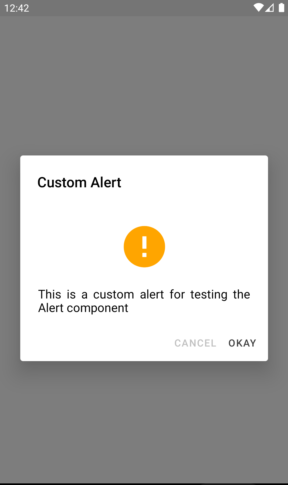

# react-native-popup-alert

This is a custom component for React Native, a simple popup alert, compatible with ios and android.

## Installation

#### yarn

```
yarn add https://github.com/usmankiani256/react-native-popup-alert
```

or

#### npm

```
npm i --save https://github.com/usmankiani256/react-native-popup-alert
```

## Usage

```js
import React, { useEffect } from 'react'
import { PopupAlert, showPopup } from 'react-native-popup-alert'

const App = () => {
  // Call the PopupAlert Component on component mount
  useEffect(() => {
    showPopup({
      icon: 'alert-circle', // Icon name from Material Community Icons
      iconSize: 70, // Size of the icon in pixels
      iconColor: 'orange', // Color of the icon
      autoDismiss: 5, // Automatically dismiss the alert after provided seconds
      title: 'Custom Alert', // Title of the alert
      body: 'This is a custom alert for testing the Alert component', // Body of the alert
      buttons: [
        // Buttons for the alert
        {
          name: 'Okay',
          onPress: () => {
            showPopup(null)
          },
        },
      ],
    })
  }, [])

  // Render the Alert Component, recommended to use in initial screen
  return <PopupAlert />
}

export default App
```

### PopupAlert

The Alert component that displays the Alert

> :warning: recommended to use in initial screen

### showPopup

#### params

| Param       | Type   | Description                                                                                            | Default                              |
| :---------- | :----- | :----------------------------------------------------------------------------------------------------- | :----------------------------------- |
| icon        | Button | Uses name from Material Community Icons, if icon name is not provided Alert will not display any icon. | "alert-circle"                       |
| iconSize    | Number | It is the iconSize in pixels, if iconSize is not provided it will take default value of pixels.       | '30'                                 |
| iconColor   | String | If color is not provided icon will display in default color.                                           | 'grey'                               |
| autoDismiss | Number | If number is provided Alert will be dismissed after the provided seconds.                              | -                                    |
| title       | String | The Title of the popup alert component                                                                 | "Alert"                              |
| body        | String | The body of the popup alert component                                                                  | "This is a custom alert description" |
| buttons     | Array  | An array of buttons objects passed to the component, the button object passed has the following props: | -                                    |

#### button object

| Param   | Type   | Description             |
| :------ | :----- | :---------------------- |
| label   | String | The label of the button |
| onPress | Func   | The onPress Callback    |

<!--
## Contributing

## Credits -->

## Screenshot

| :---------------------------------------------: |
|  |

## License

MIT License

Copyright (c) 2021 Muhammad Usman Kiani

Permission is hereby granted, free of charge, to any person obtaining a copy
of this software and associated documentation files (the "Software"), to deal
in the Software without restriction, including without limitation the rights
to use, copy, modify, merge, publish, distribute, sublicense, and/or sell
copies of the Software, and to permit persons to whom the Software is
furnished to do so, subject to the following conditions:

The above copyright notice and this permission notice shall be included in all
copies or substantial portions of the Software.

THE SOFTWARE IS PROVIDED "AS IS", WITHOUT WARRANTY OF ANY KIND, EXPRESS OR
IMPLIED, INCLUDING BUT NOT LIMITED TO THE WARRANTIES OF MERCHANTABILITY,
FITNESS FOR A PARTICULAR PURPOSE AND NONINFRINGEMENT. IN NO EVENT SHALL THE
AUTHORS OR COPYRIGHT HOLDERS BE LIABLE FOR ANY CLAIM, DAMAGES OR OTHER
LIABILITY, WHETHER IN AN ACTION OF CONTRACT, TORT OR OTHERWISE, ARISING FROM,
OUT OF OR IN CONNECTION WITH THE SOFTWARE OR THE USE OR OTHER DEALINGS IN THE
SOFTWARE.
